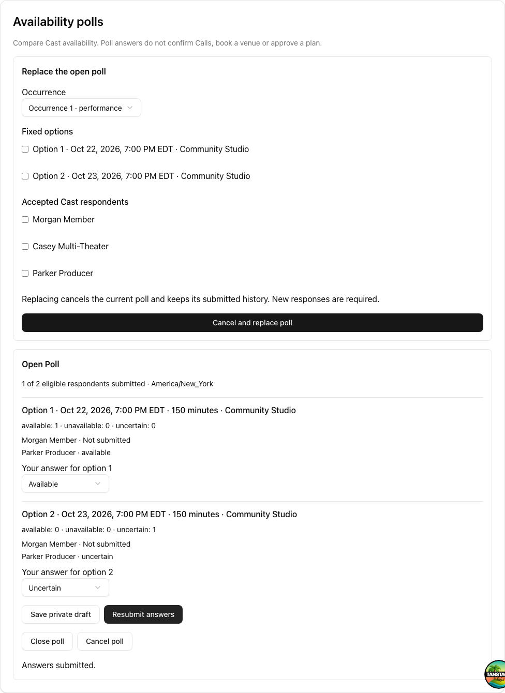
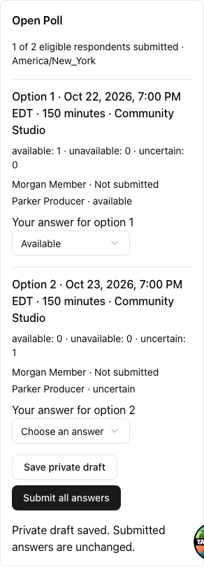
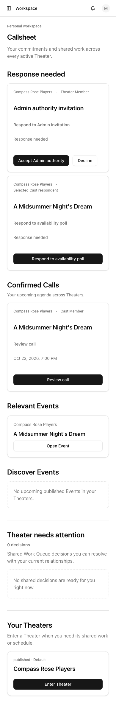

# Availability poll approval packet (STA-69)

The local implementation is ready for maintainer presentation review. Standards
and Spec reviews have no outstanding findings, including the final delivery delta.

## Walkthrough

Open <http://localhost:3100/login>. The preview is running against local Supabase.
The owned demo dataset contains one open poll with two options and two respondents.
Parker Producer has submitted Available / Uncertain. Morgan Member has saved only
an Available answer for the first option as a private draft.

1. Choose **Event Producer**, open **A Midsummer Night's Dream**, then **Cast &
   Team**. Review the option selection, fixed-poll explanation, named responses,
   missing response and totals. Option selection and the open poll both use the
   Theater time zone (America/New_York).
2. In a separate browser session choose **Theater Member**. Callsheet has
   **Respond to availability poll** alongside the existing confirmed Call. Follow
   the action; Morgan's private draft is restored, while comparison still says
   Morgan has not submitted.
3. Answer the second option and submit. Return to Callsheet: the poll action is
   cleared and the confirmed Call remains. Resubmit from the Event, then inspect
   the new submitted answers as Producer after reloading.
4. As Producer, close the poll explicitly. Member controls become disabled after
   refresh; submitted history remains. To try replacement instead, select options
   and respondents in the replacement form while the poll is still open.

These are disposable local demo records. `npm run demo:seed` restores the initial
story and clears only owned demo polls. The walkthrough mutates those records;
reload the other session to inspect committed changes.

## Captured presentation

Desktop leader view at a 1280px viewport:

Member private draft at a 390px viewport with mobile/touch browser emulation:

Member Callsheet at a 390px viewport:

Screenshots were visually inspected. Automated checks cover 360/390/1280px widths,
keyboard focus and activation, recovery and persistence. They do not establish
physical-device software-keyboard behavior or substitute for your presentation
approval. Branding remains a separate later gate.

## Remote integration plan

Read-only Supabase inspection identified hosted project **stagecom**
(`obufimjayisdhkjjxhfd`). Its 60 migration version/name entries match the repository
exactly; no remote-only entries exist. This verifies migration history, not the
absence of out-of-band schema edits. Supabase Preview on PR #65 was skipped and
there is no separate PR preview branch.

Only `20261001221258_availability_polls.sql` is pending. It creates the poll
persistence, RLS and authorized RPCs; existing Candidate Slot responses, Calls and
approval/readiness behavior remain separate. Local fresh-schema application and
26 poll database assertions passed.

Before deploying this application version to that hosted target:

1. Obtain explicit approval to apply that exact migration to that exact project.
2. Apply the committed migration and confirm its migration-history entry.
3. Verify the new tables have RLS and the RPCs/read policies are installed with
   the committed grants. Regenerate/compare hosted database types if appropriate.
4. Deploy the application through the normal release process, then smoke-test an
   authorized poll flow and denied reads using approved test records.

No remote schema or seed operations have been executed. The discovered project
has not been established as a dedicated disposable demo target; remote demo
seeding is therefore not part of this plan. The application code can be rolled
back while retaining new tables and submitted history; do not drop those tables
as an application rollback.
